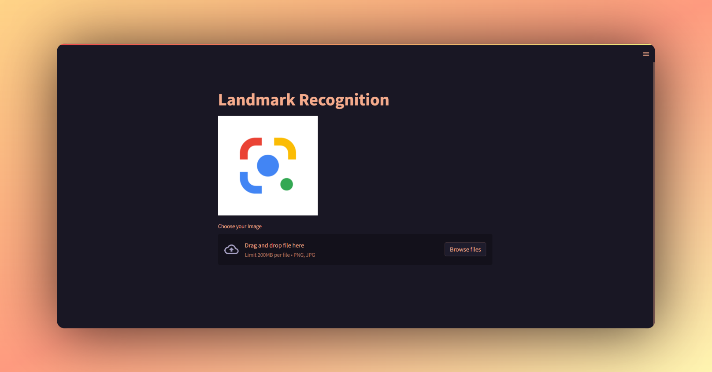

# Landmark
This application was created to advance Indonesian tourism.
So tourists can find out what landmarks are in Indonesia.

This landmark is not only a tourist attraction for local and foreign tourists but also a symbol of the identity of a city or region. Therefore, it is essential to preserve and maintain the existence of this landmark as part of Indonesia's cultural heritage.

